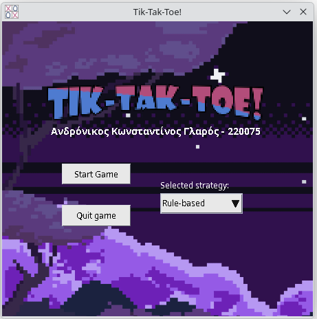
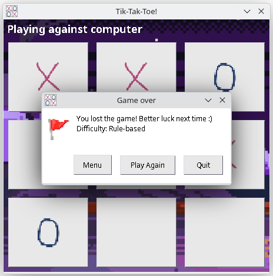

#  TikTakToe Retro  
A simple tik-tak-toe game written in java according to the design parttern principles

  
  

## Assets

- Background images (bg.png, bg2.png)  
  Attribution: Image by pikisuperstar on Freepik
